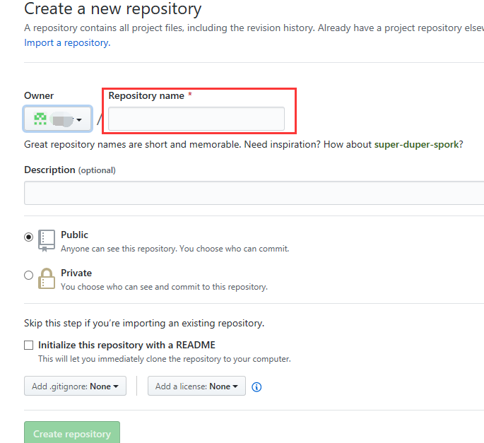
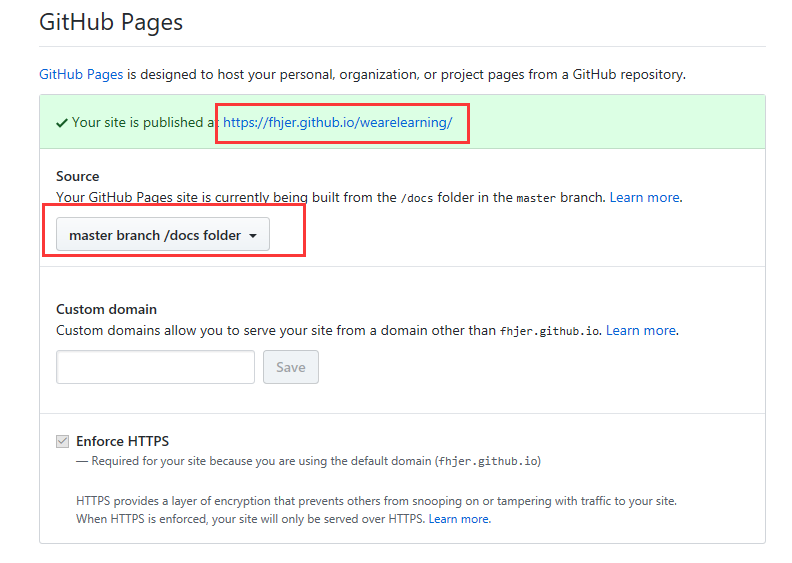

# 部署到GitHub

将docsify建立的文档系统放置到GitHub上并发布出来，让大家都可以阅读。

## 安装Git

若未安装Git，请先[下载](<https://git-scm.com/download/>)安装。

## 配置GitHub

1. 注册GitHub账号。

2. 登录GitHub，开始创建新repository。

   

3. 配置仓库。

   

4. 将仓库clone到本地。

   `git clone 仓库的git地址`

5. 将docs目录拖放到本地仓库中。

   若没有docs目录，执行命令在本地目录下生成即可。

6. 提交至GitHub。

   ```bash
   git pull  //拉取最新文件
   git status //查看本地修改了哪些文件
   git add . //提交改动
   git commit -m "修改说明"//提交修改至本地仓库
   git push  //提交至GitHub
   ```

   

7. 在GitHub上，单击“Settings”。

   

   

8. 配置GitHub Pages：配置Source为`master barnch /docs folder`。

   项目会自动发布，访问发布的网址可查看发布结果。

   > [!Note]
   >
   > 若一开始建仓库时设置的是私有仓库，那么需要自己购买域名；或者，在其下方的`Danger Zone`区域将该仓库设置为public。

